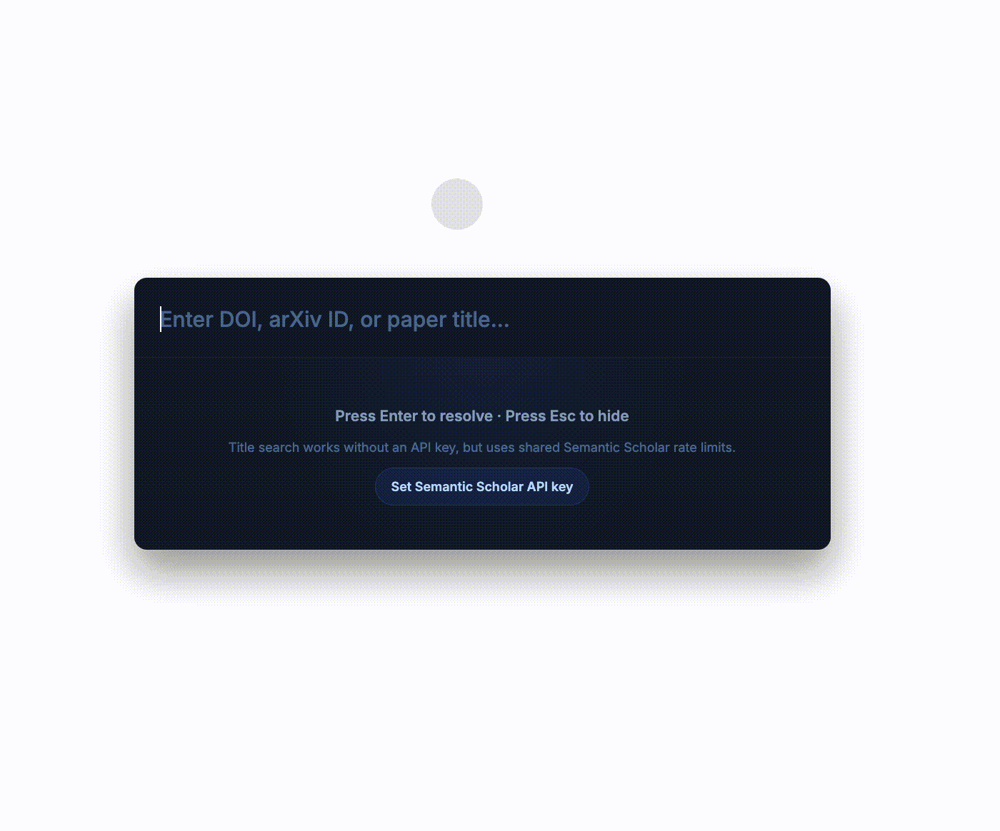

  

<h1 align="center">any2bibtex</h1>

<strong>一个高效的桌面 BibTeX 生成工具。</strong>

  <a href="README.md">English</a> | 简体中文

  
  
  

### 功能

- **智能输入** - 自动识别 DOI、arXiv ID 或论文标题
- **快速生成** - 在几秒内得到 BibTeX
- **一键复制** - 直接复制格式化后的 BibTeX
- **Spotlight 风格界面** - 简洁、轻量、适合键盘操作
- **全局快捷键** - macOS 使用 `Option+Space`，Windows/Linux 使用 `Alt+Space`

### 安装

| 平台 | 下载 | 安装方式 |
| --- | --- | --- |
| macOS | [any2bibtex.dmg](https://github.com/little1d/any2bibtex/releases/latest) | 打开 DMG 后拖入 Applications |
| Windows | [any2bibtex-Setup.exe](https://github.com/little1d/any2bibtex/releases/latest) | 运行安装程序 |
| Linux | [any2bibtex.AppImage](https://github.com/little1d/any2bibtex/releases/latest) | `chmod +x` 后运行 |

### 使用

1. 按 `Option+Space` (macOS) 或 `Alt+Space` (Windows/Linux) 打开窗口
2. 输入 DOI (`10.1038/nphys1170`)、arXiv ID (`2205.15019`) 或论文标题 (`Attention Is All You Need`)
3. 按 **Enter**
4. 点击 **Copy BibTeX**

#### 标题检索说明

- 标题检索使用 Semantic Scholar。
- 没有 API key 时仍然可以检索标题，但会使用共享速率限制，在高峰时可能遇到 rate limit。
- 可以在应用内配置 Semantic Scholar API key，让标题检索更稳定。
- Semantic Scholar API key 当前限制为 `1 request/second`，并且所有 endpoint 累计计算。
- API key 申请地址：<https://www.semanticscholar.org/product/api#api-key-form>

### 技术栈

| 层级 | 技术 |
| --- | --- |
| 前端 | [Vue 3](https://vuejs.org/) + [TypeScript](https://www.typescriptlang.org/) + [Tailwind CSS](https://tailwindcss.com/) |
| 桌面端 | [Tauri 2](https://tauri.app/) |
| 后端 | [Rust](https://www.rust-lang.org/) Tauri commands |
| 构建 | [Vite](https://vitejs.dev/) + [Cargo](https://doc.rust-lang.org/cargo/) |

### Roadmap

- [x] 改进标题检索匹配质量和 fallback 行为
- [x] 从 Electron + Python 后端迁移到 Tauri + Rust resolver
- [ ] 应用内自动更新：检测新版本、显示下载进度、提示重启并展示更新成功
- [ ] 相似文献检索：输入摘要，找到相关论文
- [ ] 改进跨平台打包和签名流程

### Star History

